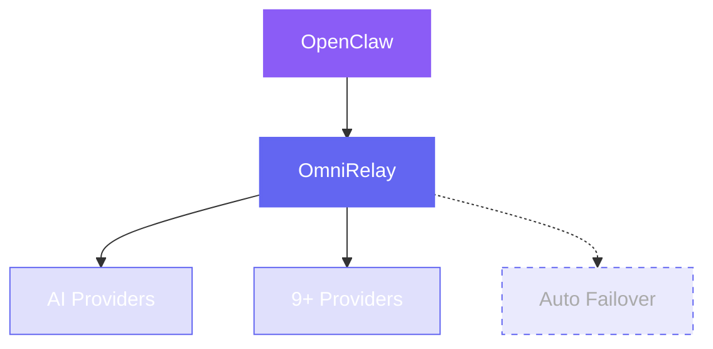
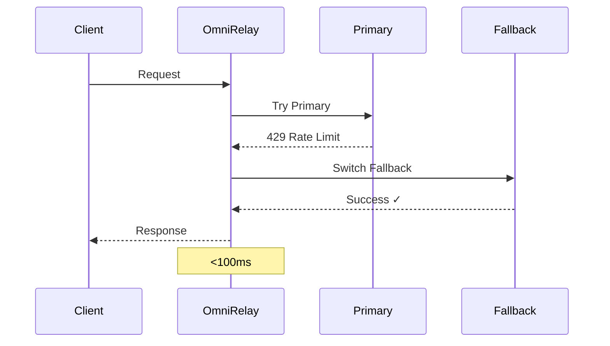

# OmniRelay

> **AI Resilience Middleware for OpenClaw — Multi-cloud LLM failover in under 100ms**

[](https://opensource.org/licenses/MIT)
[](https://python.org)
[](https://github.com/openclaw/openclaw)
[](#provider-pool)

OmniRelay is an **LLM API aggregator and failover router** that sits between OpenClaw and your AI providers. When a model hits a rate limit or goes down, OmniRelay switches to the next provider in your chain — automatically, in milliseconds, with no code changes required.

```
Your request → OmniRelay → [DeepSeek R1 → 429] → [Grok 3 → OK ✓]
                                       ↑ <100ms switch ↑
```

---

## Why OmniRelay?

Every developer building with AI APIs hits the same wall:

| Problem | What Actually Happens | OmniRelay Fix |
|---------|----------------------|---------------|
| **Rate limits** | Your agent stops mid-task | Auto-switch to next provider in <100ms |
| **Single point of failure** | One outage kills everything | 9 providers, round-robin or priority routing |
| **Vendor lock-in** | Tied to one API's pricing/quality | Swap providers without changing code |
| **Free tier fragmentation** | $20 here, 1M tokens there | Unified CLI manages all credits in one place |
| **Manual config** | Edit JSON, restart, repeat | `relay auto` — one command reconfigures OpenClaw |

---

## Feature Matrix

| Feature | Details |
|---------|---------|
| **Providers** | 9 (DeepSeek, Novita AI, xAI, Gemini, Qwen, OpenAI, Zhipu, Kilo, OpenRouter) |
| **Failover latency** | < 100ms |
| **Error detection** | HTTP 429 / 503, keyword patterns (`rate limit`, `quota exceeded`, …) |
| **Routing strategies** | `quality` · `speed` · `balanced` (round-robin) |
| **Cooldown tracking** | Persists across restarts (`~/.openclaw/.omnirelay-cooldown.json`) |
| **Free model database** | GitHub Actions updates every 3 days, 34+ free models |
| **Identity headers** | Every request carries `User-Agent`, `X-Title`, `HTTP-Referer` |
| **OpenClaw integration** | Native skill — auto-updates agent model config |

---

## Quick Start

### 1. Install

```bash
openclaw skills install omnirelay   # via OpenClaw skill manager

# or manually:
git clone https://github.com/parkwoo/omni-relay.git ~/.openclaw/skills/omnirelay
cd ~/.openclaw/skills/omnirelay && pip install -e .
```

### 2. Configure API Keys

Set at least one provider — the more you add, the more resilient your setup:

```bash
export NOVITA_API_KEY="sk-novita-..."    # $20 free credits (partner)
export XAI_API_KEY="xai-..."            # $25/month free
export GEMINI_API_KEY="AIza-..."        # 1M tokens/day free
export DEEPSEEK_API_KEY="sk-..."        # $5 one-time
export DASHSCOPE_API_KEY="sk-..."       # Qwen, 1M+/month
export OPENROUTER_API_KEY="sk-or-..."   # 30+ free models
```

### 3. Auto-configure and Restart

```bash
relay auto
openclaw gateway restart
```

That's it. OpenClaw now routes through a 5-provider fallback chain.

---

## Architecture



**On error (429 / 503):** Auto-switch to next provider in <100ms

---

## Core Features

### Intelligent Failover
OmniRelay detects rate-limit and overload signals from any provider:
- **HTTP 429** — Too Many Requests
- **HTTP 503** — Service Unavailable
- Keywords: `rate limit exceeded`, `quota exceeded`, `service overloaded`

On detection, it marks the model in a 30-minute cooldown (persisted to disk) and routes the same request to the next provider — all within a single HTTP transaction from OpenClaw's perspective.

### Multi-Strategy Routing

```bash
relay auto --strategy quality    # highest quality model first (DeepSeek R1 → Grok 3 → GPT-4o …)
relay auto --strategy speed      # lowest latency first (Gemini Flash → Grok → Qwen …)
relay auto --strategy balanced   # round-robin across providers (maximum rate-limit resilience)
relay auto --count 10            # set fallback chain length (default: 5)
```

### Cost Optimization
Aggregates free tiers across 9 providers. With all providers configured:
- **Free credits:** $60+ one-time (Novita $20, xAI $25, DeepSeek $5, Kilo $5, OpenAI $5)
- **Monthly credits:** $150+ (xAI data sharing, Qwen 1M+ tokens, Gemini 1M tokens/min)
- **Permanently free:** GLM-4.x-Flash, MiniMax M2.5, OpenRouter 30+ models

\* xAI: Enable data sharing program for $150/month credits  
† Zhipu: GLM-4.x-Flash series free since Aug 2024 (rate limits may apply)  
‡ Kilo: MiniMax M2.5 permanently free + $5 credit

### OpenClaw Native Integration
`relay auto` writes directly to `~/.openclaw/openclaw.json`. OpenClaw picks up the new model chain on restart — no manual JSON editing.

---

## Provider Pool

| Provider | Free Quota | Top Models | Latency |
|----------|-----------|------------|---------|
| **DeepSeek** | $5 one-time | R1 (Reasoner), V3 (Chat) | Medium |
| **Novita AI** ★ | $20 one-time | DeepSeek R1, Llama 3.1 70B | Low |
| **xAI** | $25 one-time + $150/month* | Grok 3, Grok 3 Mini | Low |
| **Google Gemini** | 1M tokens/min | 2.5 Flash, 2.0 Flash | Very Low |
| **Alibaba Qwen** | 1M+/month | Max, Plus, Turbo | Low |
| **OpenAI** | $5 trial | GPT-4o, GPT-4o Mini | Low |
| **Zhipu AI** | GLM-4.x-Flash free† | GLM-4.7-Flash, GLM-4-Air | Low |
| **OpenRouter** | 30+ free models | Various | Medium |
| **Kilo** | $5 + MiniMax M2.5 free‡ | MiniMax M2.5, NVIDIA Nemotron 3 Super | Medium |

★ OmniRelay partner — [Get $20 free credits](https://novita.ai/?ref=mjdjzgr&utm_source=affiliate)

Run `relay credits` to print all signup links in the terminal.

---

## How It Works

After `relay auto`, your OpenClaw config looks like this:

```json
{
  "agents": {
    "defaults": {
      "model": {
        "primary": "deepseek-reasoner",
        "fallbacks": ["deepseek/deepseek-r1", "grok-3", "gemini-2.0-flash", "qwen-max"]
      }
    }
  }
}
```

### Request Flow



**What happens:**
1. OpenClaw sends request → `deepseek-reasoner`
2. DeepSeek returns HTTP 429 → OmniRelay marks cooldown, retries with `grok-3`
3. Grok responds → result returned to OpenClaw as if nothing happened
4. After 30 minutes, `deepseek-reasoner` re-enters the rotation automatically

---

## CLI Reference

```bash
relay auto [--strategy quality|speed|balanced] [--count N]
relay list [--provider NAME] [--count N]
relay switch <model-id> [--fallback]
relay status
relay providers
relay credits
relay rate-limit [--rps N] [--delay MS]
relay refresh --models            # refresh OpenRouter free model list
relay refresh --clear-cooldown    # reset all cooldowns
relay refresh --clear-model <id>  # reset one model
```

Full parameter reference: [USAGE.md](USAGE.md)

---

## Contributing

1. Fork the repo
2. Create a feature branch
3. Run tests: `pytest tests/ -v` (110 tests, all must pass)
4. Submit a pull request

GitHub Topics: `ai-api` `llm-failover` `api-aggregator` `rate-limit` `multi-cloud` `openclaw` `deepseek` `high-availability` `python`

---

## Sponsors

**OmniRelay is proudly sponsored by [Novita AI](https://novita.ai/?ref=mjdjzgr&utm_source=affiliate).**

Novita AI provides the infrastructure that makes OmniRelay's primary routing reliable — fast inference, OpenAI-compatible APIs, and DeepSeek R1 access at competitive prices.

**New users get $20 free credits — no credit card required:**

👉 **[Sign up at novita.ai](https://novita.ai/?ref=mjdjzgr&utm_source=affiliate)**

| What you get | Details |
|-------------|---------|
| **$20 free credits** | One-time bonus, credited instantly on signup |
| **DeepSeek R1** | World-class reasoning model via OpenAI-compatible API |
| **Llama 3.1 70B** | 131k context, fast inference |
| **No rate limits** on paid tier | Scale without interruption |
| **Low latency** | Among the fastest inference providers globally |

---

## Acknowledgments

- **[OpenClaw](https://github.com/openclaw/openclaw)** — the AI coding agent platform this integrates with

---

## License

MIT — see [LICENSE](LICENSE)

---

## Support

- GitHub: https://github.com/parkwoo/omni-relay
- Issues: https://github.com/parkwoo/omni-relay/issues
- Discussions: https://github.com/parkwoo/omni-relay/discussions
